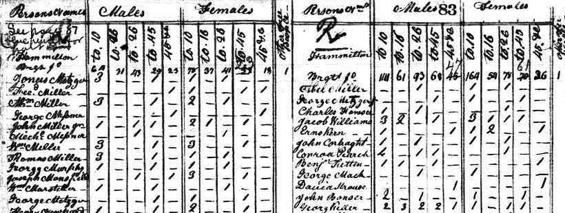
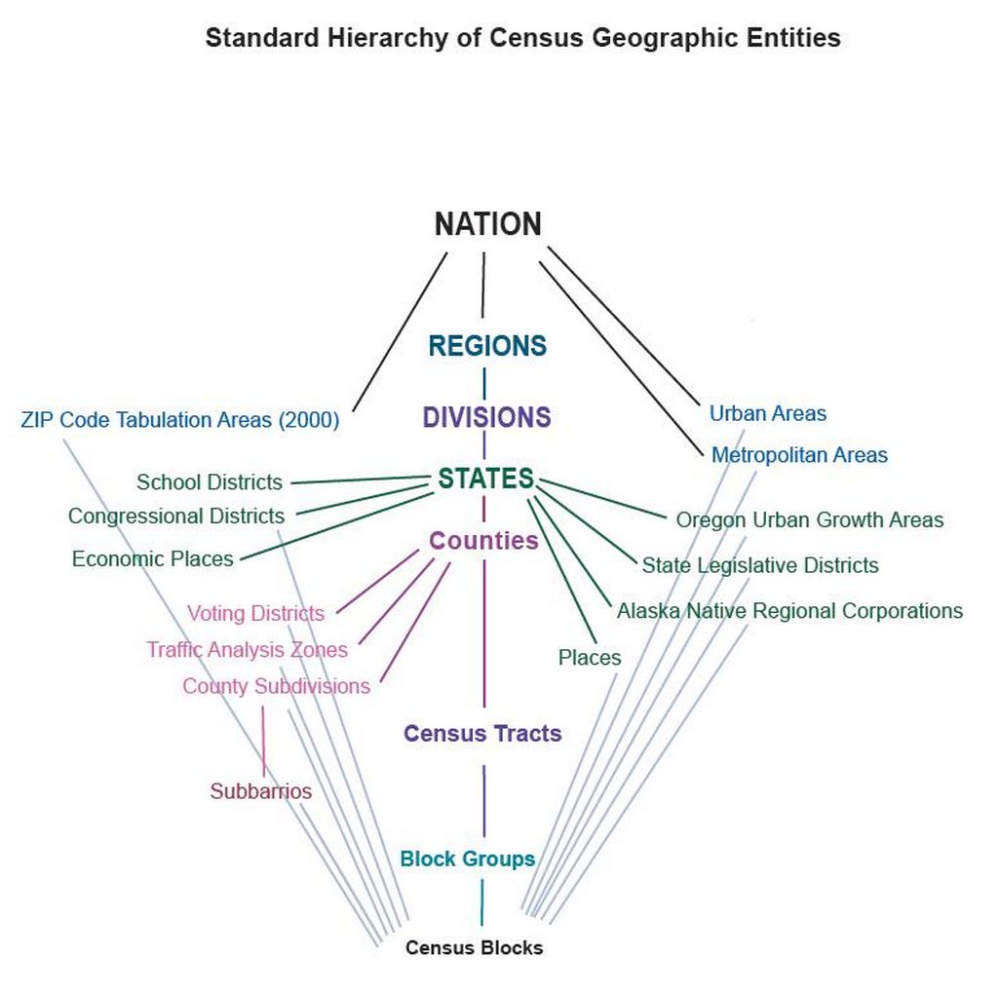
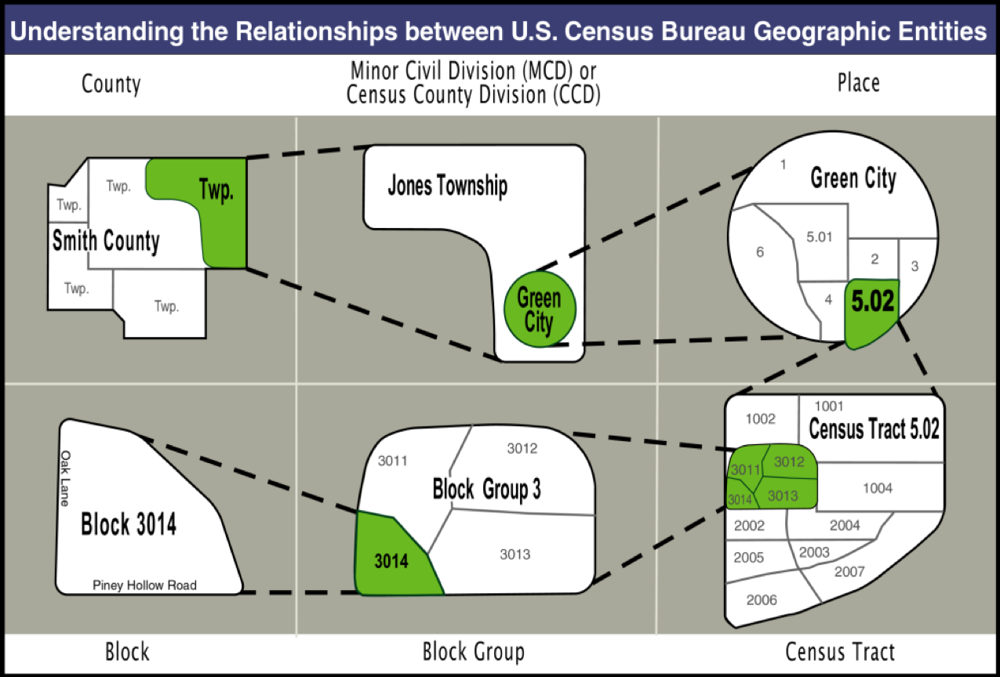

  
  
## Introduction to the U.S Census and the American Community Survey
  
UC Berkeley Library 

Fall 2017

## Why does the U.S have a census?

Congressional Redistricting!

> "The actual Enumeration shall be made within three Years after the first Meeting of the Congress of the United States, and within every subsequent Term of ten Years, in such Manner as they shall by Law direct."

Article 1, Section 2 of the U.S. Constitution.

## 1790 Census
  

## Census Geography

To find Census information, you need to understand Census Geography

{width=50%}

## Census Geography

## Census Confidentiality

- Census says it never wants to disclose information that could lead to an identity of a person or household

- How confidential? [WWII and Japanese Internment](https://www.scientificamerican.com/article/confirmed-the-us-census-b/)

## Decennial Census Data

- Counts voting age population for redistricting
  
- Census Short Form: Basic demographics data: age, sex, race, Hispanic/Latino
origin, household relationship, residence owned or rented
    - Data asked of everyone
  
- Census Long Form: 1940-2000
    - Sampled 1 in 6 households(~17%)

## Decennial Census Data

- Problems
    - 10 year wait for new data
    - Many grant programs require census data
    - Researchers and local communities wanted more current information
    

-----

## American Community Survey (ACS)

- Replaces the Decennial Census Long Form with over 60 questions.

- 3 millions households/year receive a form (250,000 households per month)

- ACS started in 2005 to provide more current data

- Provides a snapshop of areas based on a rolling 1, 3, and 5 year average. 

- ACS is not a census -- ACS is a survey

## ACS Data Includes

| Demographic Characteristics | Social Characteristics | Economics Characteristics  | Housing Characteristics |
|-----------------------------|------------------------|----------------------------|-------------------------|
| Sex                         | Eduation               | Income                     | Tenure                  |
| Age                         | Marital Status         | Benefits                   | Occupancy & Structure   |
| Hispanic Origin             | Marital History        | Occupation                 | Housing Value           |
| Race                        | Fertility              | Industry                   | Taxes and Insurance     |
|                             | Grandparent Caregivers | Commuting to work          | Utilities               |
|                             | Veterans               | Place of work              | Mortgage/Monthly Rent   |
|                             | Disability Status      |                            |                         |
|                             | Health Insurance       |                            |                         |
|                             |                        |                            |                         |

## ACS Data: Available by Geography

- Areas with a population 65,000+: 1-Year Estimates data avail. for 2005-2016

- Areas with a population 20,000+: 3-Year Estimates (data avail. for 2005/07-2011/14—ended in 2014)  :(

- Areas below 20,000: 5-year estimates (data available for 2005/09-2011/15) 
	    (5-year estimates includes census tracts & block groups

## ACS vs. Census

| ACS                                                 | Census                                         |
|-----------------------------------------------------|------------------------------------------------|
| Samples 3 million households                        | Samples 18 million households                  |
| Monthly data collection                            | Data mostly collected between March and August |
| Timely and available every year                     | Every 10 years                                 |
| Provides **estimates** of characteristics of population | Provides population counts                     |

## Comparing Across Time Periods in ACS

- Be aware of changes in Census geography-more common in small area geography.

- Compare estimates from same time spans
    - 1 year to 1 year
    - 3 year to 3 year
    - 5 year to 5 year
   
- Compare non-overlapping time period

- Be aware of changes in wording of questions

## Race and Ethnicity

- Guidelines provided by the [U.S Office of Management and Budget (OMB)](https://www.whitehouse.gov/omb/fedreg_race-ethnicity)
    - Social definition of race recognized by the U.S government
    - Not biological or anthropological definitions
    

- Uses of the data
    - Meet legislative redistricting requirements
    - Monitor compliance with Voting Rights Act
    - Assess home mortgage lending patterns of financial institutions to meet credit needs of minorities
    - Assess racial disparities in health
    
## Race and Ethnicity Categories

- 5 Races
    - White alone
    - Black or African-American alone
    - American Indian or Alaska Native alone
    - Asian alone
    - Native Hawaiian or other Pacific Islander alone

- Hispanic or Latino
    - Includes people who reported Hispanic origin
    
- Not Hispanic or Latino
    - Includes people who identified as not being of Hispanic origin
    

## How Census Race Categories Have Changed

http://www.pewsocialtrends.org/interactives/multiracial-timeline/

http://racebox.org/

    
    
## Statistical and Data Sources

| Statistical Sources      | Data Sources  |
|--------------------------|---------------|
| American FactFinder      | IPUMS         |
| State/County Quick Facts | Census FTP    |
| Social Explorer*          | NHGIS         |
| Simply Map*               | ICPSR*         |
| Data Planet*              | Berkeley SDA  |
|                          | UC Data/CCRDC* |

<small>*Restricted to Berkeley users</small>

## Contact

ssd-datalab@berkeley.edu

